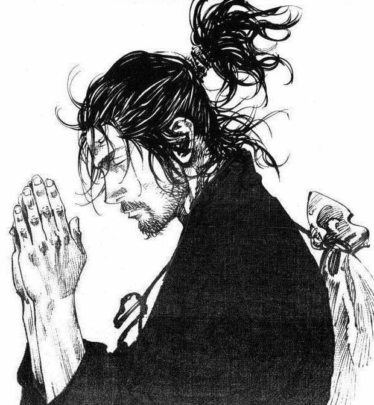

# El arte de la redención

Este proyecto presenta una página web dedicada a Miyamoto Musashi, un legendario espadachín japonés, y su viaje de autodescubrimiento y redención.

## Descripción

La página web describe la vida de Miyamoto Musashi, un joven feroz y ambicioso decidido a convertirse en el mejor espadachín de Japón. Inicialmente impulsado por la violencia y la búsqueda de poder, Musashi comienza a cuestionar la naturaleza del combate y su propio propósito. A través de encuentros con maestros espadachines y personajes significativos como Otsu y Sasaki Kojiro, Musashi emprende un camino de introspección y autodescubrimiento.

El contenido se centra en su transformación de un guerrero brutal a un individuo en búsqueda de equilibrio y paz interior. La historia ilustra que la verdadera maestría no reside en derrotar a otros, sino en dominarse a sí mismo.

## Estructura del Proyecto

- **index.html**: El archivo principal de la página web.
- **styles/style.css**: Hoja de estilos para la página.
- **scripts/main.js**: Archivo JavaScript para funcionalidades adicionales.
- **images/musashi.jpg**: Imagen de Miyamoto Musashi rezando.

## Tecnologías Utilizadas

- HTML5
- CSS3
- JavaScript
- Google Fonts (Ubuntu Sans Mono)

## Recursos
- Takehiko Inoue(https://itplanning.co.jp/)
- Ilustration(https://pm1.aminoapps.com/8119/cb8bd7a34e536c41e5b18510c3741fac67384be6r1-620-672v2_uhq.jpg)
- Hello World!(https://github.com/abdiasejr)
